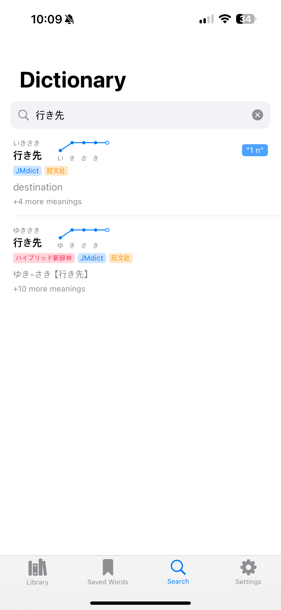
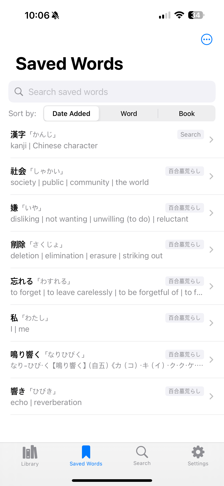
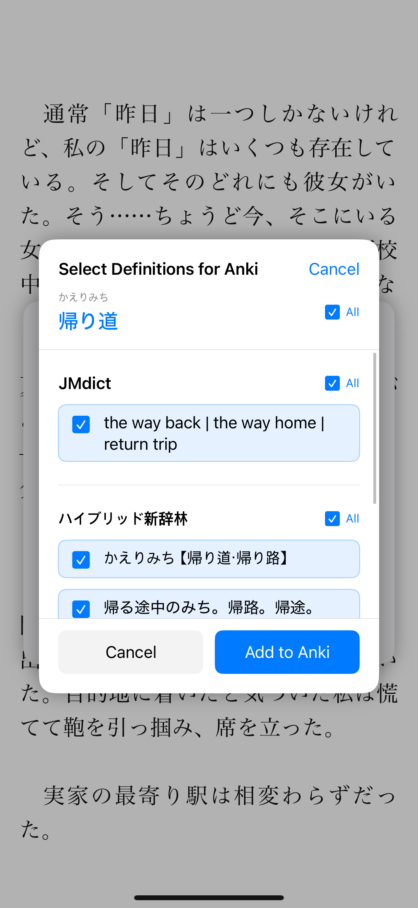

# Shiori Reader

**[Download on the App Store](https://apps.apple.com/us/app/shiori-reader/id6744979827)**

Shiori Reader is an iOS application designed for Japanese language learners to read EPUB books with powerful dictionary and vocabulary learning features.

**Get the app from the App Store for the best experience!** The App Store version includes all features and regular updates.

## Screenshots

<p align="center">
  
  
  
</p>

<p align="center">
  
  
  
</p>

## Features

### Advanced Reading Experience

- Seamless EPUB book rendering using Readium
- Minimal, elegant UI designed for distraction-free reading with clean typography and intuitive controls
- Customizable reading preferences (font, size, background and font colors, dictionary popup appearance)
- Pagination and scroll modes
- Progress tracking and bookmark functionality
- Context menu in dictionary popup to quickly search adjacent words

### Japanese Language Learning Tools

- One-tap, instant word lookups
- Comprehensive dictionary integration with built-in dictionaries (JMdict (Japanese-English bilingual dictionary), BCCWJ Frequency Data, Kanjium Pitch Accents)
- Import functionality for Yomitan-formatted dictionaries
- Support for kanji, furigana, pitch accent, and complex Japanese text
- Context-aware word selection

### Vocabulary Management

- Save words directly from the reader
- Export words to Anki for spaced repetition learning
- Select specific definitions to send to Anki for optimized cards
- Saved words management with tagging and filtering

### Advanced Dictionary Functionality

- Deinflection support for complex verb and adjective conjugations
- Multiple dictionary lookup strategies
- Optimized dictionary searches for low latency

## Technologies

- Swift
- SwiftUI
- Readium (EPUB rendering)
- MeCab (Japanese text tokenization)
- SQLite (dictionary backend)
- Anki Integration

## Issues & Support

If you run into a bug or have a feature request, feel free to open an issue!

- [Submit an issue here](https://github.com/russgrav/Shiori-Reader/issues)

- Before submitting, please:

  - Check if the issue has already been reported

  - Include details like your device, iOS version, and steps to reproduce (if it’s a bug)

If you're not sure whether something is a bug or a question, it's totally okay — just open an issue and tag it appropriately!

## For Contributors

### Prerequisites

- macOS with Xcode 15.4+
- iOS 13.4+ for testing
- Swift 5.10+

### Getting Started

1. **Clone the repository**
   ```bash
   git clone https://github.com/russgrav/Shiori-Reader.git
   cd Shiori-Reader
   ```

2. **Download required dictionary databases**
   
   The app requires several database files that are not included in the repository due to size constraints:
   - `jmdict.db` (Japanese-English dictionary) - ~50MB
   - `bccwj.db` (Frequency data) - ~10MB  
   - `kanjium_pitch_accents.db` (Pitch accent data) - ~5MB

   **Download from releases:**
   1. Go to [Releases](https://github.com/russgrav/Shiori-Reader/releases)
   2. Download `shiori-databases-v1.0.tar.gz` from the latest release
   3. Extract: `tar -xzf shiori-databases-v1.0.tar.gz`
   4. Place all `.db` files in `Shiori Reader/Resources/`

3. **Add Readium Swift Package dependency**
   
   **Important:** You must manually add the Readium dependency:
   
   1. Open `Shiori Reader.xcodeproj` in Xcode
   2. Go to **File → Add Package Dependencies**
   3. Enter: `https://github.com/russgrav/swift-toolkit`
   4. Select **Branch: `develop`** (or latest)
   5. Add these modules to your target:
      - ReadiumShared
      - ReadiumStreamer  
      - ReadiumNavigator
      - ReadiumOPDS
      - ReadiumAdapterGCDWebServer

4. **Install remaining Swift Package dependencies**
   
   Xcode will automatically resolve these dependencies:
   - MeCab Swift (Japanese text analysis)
   - GRDB (SQLite wrapper)
   - Additional utility packages

5. **Add sample content** (Optional)
   
   For testing, add EPUB files to the `Books/` folder (gitignored) or use the in-app import feature.

### Project Structure

```
Shiori Reader/
├── App/                    # Main app entry point
├── Features/               # Feature modules
│   ├── Reader/            # EPUB reader and dictionary popup
│   ├── Dictionary/        # Dictionary management
│   ├── Library/           # Book library
│   └── SavedWords/        # Vocabulary management
├── Services/              # Core services (Dictionary, Japanese analysis)
├── Resources/             # Database files (not in repo)
└── Utilities/             # Helper classes and extensions
```

### Building and Running

1. Place database files in `Shiori Reader/Resources/`
2. Open `Shiori Reader.xcodeproj` in Xcode
3. Select your target device/simulator
4. Build and run (⌘+R)

### Contributing Guidelines

- Fork the repository and create a feature branch
- Follow the existing code style and SwiftUI patterns
- Test thoroughly on both iPhone and iPad
- Update documentation for new features
- Submit a pull request with a clear description

### Known Issues for Contributors

- Large database files not included in repository
- Custom Readium fork required (linked as dependency)
- Some features require physical device testing (file import, Anki export)

## Dependencies

- [Readium Swift Toolkit](https://github.com/russgrav/swift-toolkit) (Custom fork)
- MeCab Swift
- GRDB
- CryptoSwift
- Zip

## License

This project is licensed under the MIT License. See the LICENSE file for details.

- Permissions: ✅ Commercial use, ✅ Modification, ✅ Distribution, ✅ Private use
- Limitations: ❌ Liability, ❌ Warranty

## Credits

Created by Russell Graviet

## Disclaimer

This app is for educational purposes and to support Japanese language learning.

## Privacy Policy

Shiori Reader does not collect, transmit, or share any user data. All data including imported books, reading progress, bookmarks, and saved vocabulary words are stored locally on your device and never leave it.

The only external communication occurs when using the optional Anki integration feature, which uses iOS URL schemes to communicate with the Anki app on the same device (if installed).

No analytics, tracking, or telemetry data is collected.

Last updated: 4/23/2025
